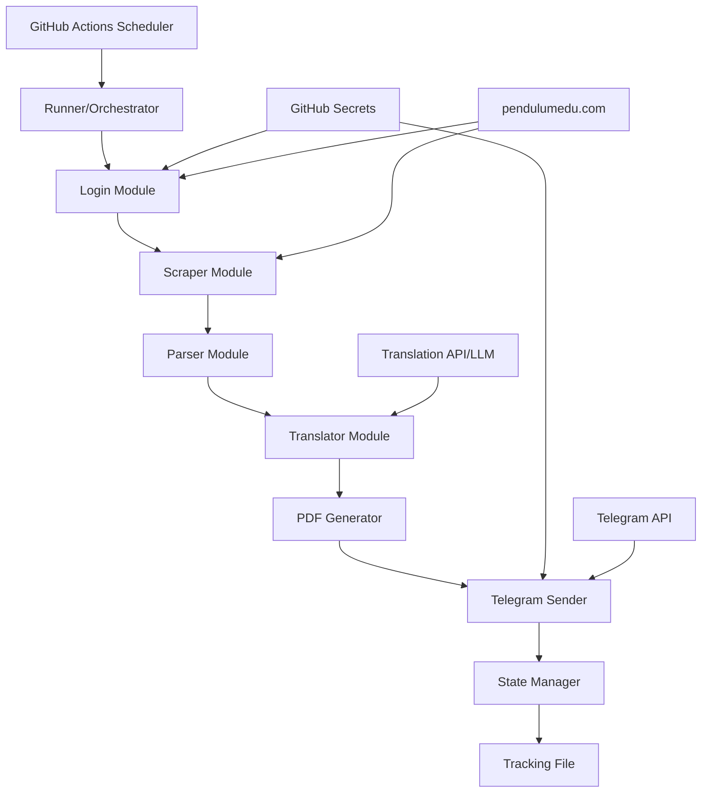

# Design Document

## Overview

The Pendulumedu Quiz Scraper is a Python-based automated system that extracts, translates, and distributes Current Affairs quiz content. The system follows a pipeline architecture where each component performs a specific transformation on the data before passing it to the next stage.

The system operates in the following sequence:
1. Authentication and session management
2. Quiz discovery and filtering
3. Content extraction
4. Translation to Gujarati
5. PDF generation with branding
6. Telegram distribution
7. State persistence

## Architecture

### High-Level Architecture



### Component Architecture

The system is organized into modular Python components:

- **runner.py**: Main orchestrator that coordinates the entire pipeline
- **login.py**: Handles authentication and session management
- **scraper.py**: Fetches quiz listing and individual quiz pages
- **parser.py**: Extracts structured data from HTML
- **translator.py**: Translates content to Gujarati
- **pdf_generator.py**: Creates formatted PDF documents
- **telegram_sender.py**: Distributes PDFs via Telegram
- **State management**: Handled through JSON file operations

## Components and Interfaces

### 1. Login Module (login.py)

**Purpose**: Authenticate with pendulumedu.com and maintain session state

**Interface**:
```python
class LoginManager:
    def __init__(self, email: str, password: str):
        """Initialize with credentials from environment variables"""
        
    def login(self) -> requests.Session:
        """
        Authenticate and return session object
        Returns: requests.Session with authenticated cookies
        Raises: AuthenticationError if login fails
        """
```

**Implementation Details**:
- Uses `requests.Session()` to maintain cookies
- Posts credentials to https://pendulumedu.com/login
- Validates successful login by checking redirect or response content
- Returns session object for subsequent requests

### 2. Scraper Module (scraper.py)

**Purpose**: Fetch quiz listing page and individual quiz pages

**Interface**:
```python
class QuizScraper:
    def __init__(self, session: requests.Session):
        """Initialize with authenticated session"""
        
    def get_quiz_urls(self) -> List[str]:
        """
        Fetch and extract all quiz URLs from listing page
        Returns: List of quiz URLs
        """
        
    def get_quiz_page(self, url: str) -> str:
        """
        Fetch individual quiz page HTML
        Returns: HTML content as string
        """
        
    def submit_quiz(self, url: str) -> str:
        """
        Submit quiz to reveal solutions and return updated HTML
        Returns: HTML content with solutions visible
        """
```

**Implementation Details**:
- Uses BeautifulSoup for HTML parsing
- Extracts URLs from `<div class="card-section">` elements
- Handles quiz submission by triggering the submit button (may require Selenium if JavaScript-heavy)
- Implements retry logic for network failures

### 3. Parser Module (parser.py)

**Purpose**: Extract structured quiz data from HTML

**Interface**:
```python
@dataclass
class QuizQuestion:
    question_number: int
    question_text: str
    options: Dict[str, str]  # {'A': 'option text', 'B': '...', ...}
    correct_answer: str  # 'A', 'B', 'C', or 'D'
    explanation: str

@dataclass
class QuizData:
    source_url: str
    questions: List[QuizQuestion]
    extracted_date: str

class QuizParser:
    def parse_quiz(self, html: str, url: str) -> QuizData:
        """
        Extract all questions, options, answers, and explanations
        Returns: QuizData object with structured content
        """
```

**Implementation Details**:
- Uses BeautifulSoup to navigate HTML structure
- Extracts from `<div class="q-section-inner-sol">` elements
- Parses question from `<div class="q-name">`
- Extracts options from `<li>` elements with class "containerr-text-opt"
- Identifies correct answer from `<div class="solution-sec">`
- Extracts explanation from `<div class="ans-text">`
- Handles multiple questions per quiz

### 4. Translator Module (translator.py)

**Purpose**: Translate English content to Gujarati

**Interface**:
```python
@dataclass
class TranslatedQuizData:
    source_url: str
    questions: List[QuizQuestion]  # Contains translated text
    extracted_date: str

class Translator:
    def __init__(self, api_key: Optional[str] = None):
        """Initialize with translation API credentials if needed"""
        
    def translate_quiz(self, quiz_data: QuizData) -> TranslatedQuizData:
        """
        Translate all text content to Gujarati
        Preserves option labels (A, B, C, D) and URLs
        Returns: TranslatedQuizData with Gujarati text
        """
```

**Implementation Details**:
- Option 1: Use Google Translate API (googletrans library)
- Option 2: Use OpenAI/Anthropic API for translation
- Option 3: Use dedicated translation service like DeepL
- Batch translations for efficiency
- Preserves formatting and special characters
- Does not translate: option labels, channel name, URLs

**Translation Strategy**:
- Translate question text as a single unit
- Translate each option independently
- Translate correct answer description
- Translate explanation (may contain multiple paragraphs/bullet points)

### 5. PDF Generator Module (pdf_generator.py)

**Purpose**: Create formatted PDF with branding and Gujarati text

**Interface**:
```python
class PDFGenerator:
    def __init__(self, output_dir: str = "pdfs"):
        """Initialize with output directory"""
        
    def generate_pdf(self, quiz_data: TranslatedQuizData) -> str:
        """
        Generate PDF document
        Returns: Path to generated PDF file
        """
```

**Implementation Details**:
- Uses ReportLab library for PDF generation
- Registers Gujarati Unicode font (Noto Sans Gujarati)
- Creates multi-page document

**Cover Page Layout**:
- Channel name "CurrentAdda" (large, centered)
- Channel link "https://t.me/currentadda"
- Tagline "Providing Current Affairs since 2019"
- Current date in IST (formatted as "DD MMMM YYYY")
- Question count (e.g., "10 Questions")
- Clean background with subtle design elements

**Content Page Layout**:
- Each question in a bordered container
- Question number and text (bold, larger font)
- Options A-D with Gujarati text
- Correct answer highlighted in green
- Explanation section with proper spacing
- Page numbers in footer

**Styling**:
- Font: Noto Sans Gujarati for Gujarati text, Arial/Helvetica for English
- Colors: Green for correct answer, black for text, light gray for borders
- Spacing: Adequate padding between sections
- Borders: 1pt solid lines around question containers

### 6. Telegram Sender Module (telegram_sender.py)

**Purpose**: Send PDF to Telegram channel

**Interface**:
```python
class TelegramSender:
    def __init__(self, bot_token: str, channel_username: str):
        """Initialize with bot token and channel username"""
        
    def send_pdf(self, pdf_path: str, caption: str) -> bool:
        """
        Send PDF file to Telegram channel
        Returns: True if successful, False otherwise
        """
```

**Implementation Details**:
- Uses python-telegram-bot library
- Authenticates with bot token
- Sends document to @currentadda channel
- Caption format:
  ```
  Today's Current Affairs Quiz PDF
  Source: PendulumEdu
  Channel: @currentadda
  ```
- Handles file size limits (Telegram max: 50MB)
- Implements error handling and logging

### 7. State Manager

**Purpose**: Track processed quiz URLs

**Interface**:
```python
class StateManager:
    def __init__(self, tracking_file: str = "data/scraped_urls.json"):
        """Initialize with tracking file path"""
        
    def load_processed_urls(self) -> Set[str]:
        """Load set of processed URLs from file"""
        
    def is_processed(self, url: str) -> bool:
        """Check if URL has been processed"""
        
    def mark_processed(self, url: str) -> None:
        """Add URL to processed list and save to file"""
```

**Implementation Details**:
- Stores URLs as JSON array in data/scraped_urls.json
- Creates file if it doesn't exist
- Loads into memory as set for O(1) lookup
- Appends new URLs and persists after each successful processing
- Thread-safe operations (though not needed for single-threaded execution)

### 8. Runner/Orchestrator (runner.py)

**Purpose**: Coordinate the entire pipeline

**Interface**:
```python
def main():
    """Main execution function"""
    
def process_quiz(url: str, session: requests.Session, 
                 state_manager: StateManager) -> bool:
    """
    Process a single quiz through the entire pipeline
    Returns: True if successful, False otherwise
    """
```

**Execution Flow**:
1. Load environment variables (credentials, bot token)
2. Initialize StateManager and load processed URLs
3. Authenticate via LoginManager
4. Fetch quiz listing via QuizScraper
5. Filter out already-processed URLs
6. For each new quiz:
   - Fetch and submit quiz page
   - Parse quiz data
   - Translate to Gujarati
   - Generate PDF
   - Send to Telegram
   - Mark as processed
7. Commit updated tracking file (handled by GitHub Actions)

## Data Models

### QuizQuestion
```python
@dataclass
class QuizQuestion:
    question_number: int
    question_text: str
    options: Dict[str, str]  # {'A': 'text', 'B': 'text', ...}
    correct_answer: str  # 'A', 'B', 'C', or 'D'
    explanation: str
```

### QuizData
```python
@dataclass
class QuizData:
    source_url: str
    questions: List[QuizQuestion]
    extracted_date: str  # ISO format
```

### TranslatedQuizData
```python
@dataclass
class TranslatedQuizData:
    source_url: str
    questions: List[QuizQuestion]  # With translated text
    extracted_date: str
```

### Tracking File Format (scraped_urls.json)
```json
{
  "processed_urls": [
    "https://pendulumedu.com/quiz/current-affairs/16-and-17-november-2025-current-affairs-quiz",
    "https://pendulumedu.com/quiz/current-affairs/..."
  ]
}
```

## Error Handling

### Authentication Errors
- **Scenario**: Login fails due to incorrect credentials or website changes
- **Handling**: Log error with details, send notification (optional), terminate execution
- **Recovery**: Manual intervention required to update credentials

### Network Errors
- **Scenario**: Connection timeout, DNS failure, HTTP errors
- **Handling**: Implement retry logic (3 attempts with exponential backoff)
- **Recovery**: Log error and skip problematic quiz, continue with others

### Parsing Errors
- **Scenario**: HTML structure changes, missing elements
- **Handling**: Log detailed error with URL and HTML snippet, skip quiz
- **Recovery**: Manual review and parser update required

### Translation Errors
- **Scenario**: API rate limit, service unavailable, invalid response
- **Handling**: Retry with backoff, fallback to alternative service if available
- **Recovery**: Skip quiz if translation fails after retries

### PDF Generation Errors
- **Scenario**: Font missing, invalid Unicode, file system errors
- **Handling**: Log error with stack trace, skip quiz
- **Recovery**: Ensure fonts are installed in GitHub Actions environment

### Telegram Errors
- **Scenario**: Invalid bot token, channel not found, file too large
- **Handling**: Log error, do not mark quiz as processed (will retry next run)
- **Recovery**: Verify bot permissions and channel settings

### General Error Strategy
- All errors logged to stdout (captured by GitHub Actions)
- Critical errors (auth, config) terminate execution
- Per-quiz errors skip that quiz but continue processing others
- Failed quizzes remain untracked and will be retried in next run

## Testing Strategy

### Unit Tests

**login.py**:
- Test successful login with valid credentials
- Test login failure with invalid credentials
- Test session cookie persistence

**scraper.py**:
- Test quiz URL extraction from listing page
- Test quiz page fetching
- Test quiz submission (may require mocking)

**parser.py**:
- Test question extraction from sample HTML
- Test option parsing with various formats
- Test correct answer identification
- Test explanation extraction with multiple paragraphs

**translator.py**:
- Test translation of sample text
- Test preservation of option labels
- Test handling of special characters

**pdf_generator.py**:
- Test PDF creation with sample data
- Test Gujarati text rendering
- Test cover page generation
- Test multi-question layout

**telegram_sender.py**:
- Test PDF sending (use test channel)
- Test error handling for invalid tokens

**State Manager**:
- Test loading empty tracking file
- Test loading existing URLs
- Test marking URLs as processed
- Test persistence to file

### Integration Tests

- Test complete pipeline with sample quiz URL
- Test handling of already-processed URLs
- Test error recovery (skip failed quiz, continue with others)

### Manual Testing

- Run locally with test credentials
- Verify PDF output quality
- Verify Telegram delivery
- Test with various quiz formats from the website

### GitHub Actions Testing

- Test workflow execution on schedule
- Test secret injection
- Test dependency installation
- Test commit and push of tracking file

## Dependencies

### Python Libraries
```
requests==2.31.0
beautifulsoup4==4.12.2
selenium==4.15.0  # If JavaScript rendering needed
googletrans==4.0.0rc1  # Or alternative translation library
reportlab==4.0.7
python-telegram-bot==20.7
python-dotenv==1.0.0
```

### System Dependencies
- Python 3.10+
- Chrome/Chromium (if using Selenium)
- Noto Sans Gujarati font (for PDF generation)

### External Services
- pendulumedu.com (source website)
- Translation API (Google Translate, OpenAI, or similar)
- Telegram Bot API

## GitHub Actions Configuration

### Workflow File (.github/workflows/daily.yml)

```yaml
name: Daily Quiz Scraper

on:
  schedule:
    - cron: '0 3 * * *'  # 9:00 AM IST = 3:00 AM UTC
  workflow_dispatch:  # Allow manual trigger

jobs:
  scrape-and-send:
    runs-on: ubuntu-latest
    
    steps:
      - name: Checkout repository
        uses: actions/checkout@v4
        
      - name: Set up Python
        uses: actions/setup-python@v4
        with:
          python-version: '3.10'
          
      - name: Install system dependencies
        run: |
          sudo apt-get update
          sudo apt-get install -y fonts-noto-sans
          
      - name: Install Python dependencies
        run: |
          pip install -r requirements.txt
          
      - name: Run scraper
        env:
          LOGIN_EMAIL: ${{ secrets.LOGIN_EMAIL }}
          LOGIN_PASSWORD: ${{ secrets.LOGIN_PASSWORD }}
          TELEGRAM_BOT_TOKEN: ${{ secrets.TELEGRAM_BOT_TOKEN }}
        run: |
          python src/runner.py
          
      - name: Commit updated tracking file
        run: |
          git config --local user.email "action@github.com"
          git config --local user.name "GitHub Action"
          git add data/scraped_urls.json
          git diff --quiet && git diff --staged --quiet || git commit -m "Update scraped URLs [skip ci]"
          git push
```

### Required GitHub Secrets
- `LOGIN_EMAIL`: ajay.ambaliya007@gmail.com
- `LOGIN_PASSWORD`: Ajay@1308
- `TELEGRAM_BOT_TOKEN`: Bot token from @BotFather

## Security Considerations

1. **Credential Storage**: All sensitive credentials stored as GitHub Secrets, never in code
2. **Session Management**: Session objects not persisted, recreated on each run
3. **API Keys**: Translation API keys (if needed) stored as secrets
4. **Bot Token**: Telegram bot token stored as secret
5. **Repository Access**: Tracking file committed with bot account, not user credentials
6. **Rate Limiting**: Implement delays between requests to avoid overwhelming source website
7. **Error Logging**: Ensure no credentials logged in error messages

## Performance Considerations

1. **Batch Processing**: Process multiple quizzes in single run if available
2. **Translation Batching**: Batch translate multiple text segments in single API call
3. **Caching**: Session reused across multiple quiz fetches
4. **Parallel Processing**: Not needed for daily single-quiz scenario, but could be added
5. **File Size**: PDFs typically under 5MB, well within Telegram limits

## Future Enhancements

1. **Multi-language Support**: Add support for additional languages beyond Gujarati
2. **Email Distribution**: Add email delivery option alongside Telegram
3. **Web Dashboard**: Create simple dashboard to view processed quizzes
4. **Analytics**: Track quiz processing metrics and delivery success rates
5. **Notification System**: Alert on failures via email or Telegram
6. **Quiz Archive**: Maintain searchable archive of all processed quizzes
7. **Custom Branding**: Allow configuration of PDF styling and branding elements
